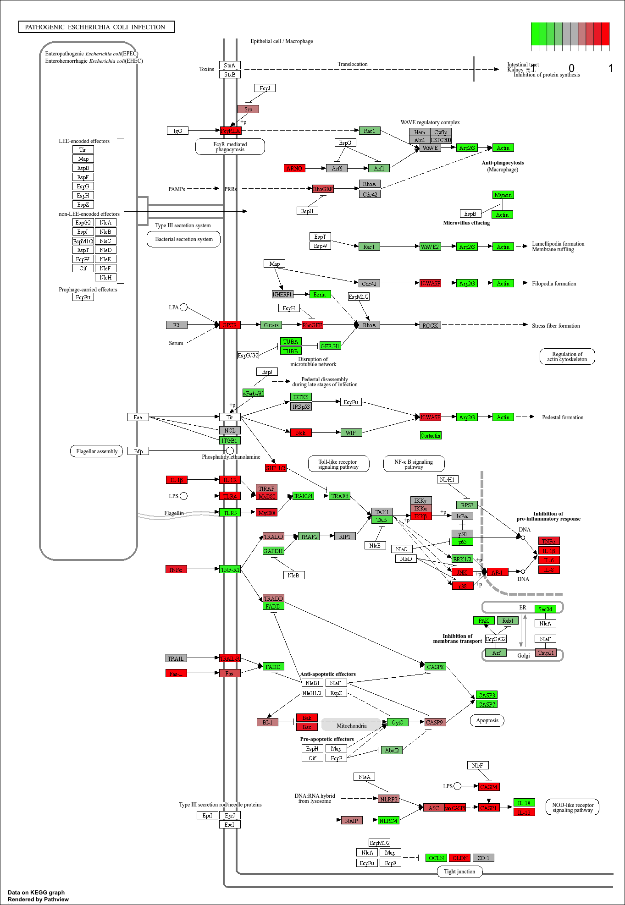
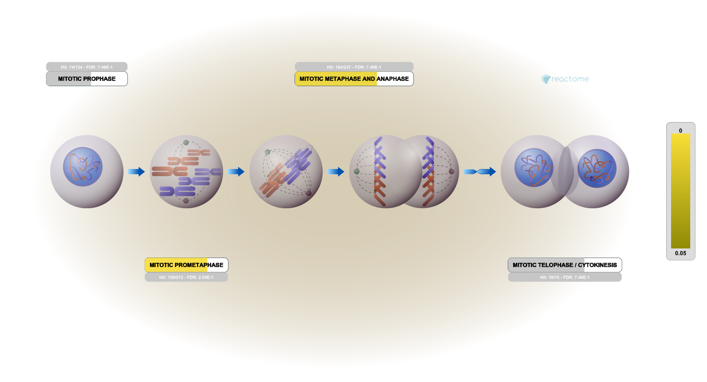

## Background

The Data for today's mini-project comes from a knock-down study of an important HoX gene. 


## Data Import
```{r}
countData <- read.csv("GSE37704_featurecounts.csv", row.names = 1)
colData <- read.csv("GSE37704_metadata.csv")
```

### Clean up (data tidying)
```{r}
countData <- as.matrix(countData[,-1])

head(colData)
head(countData)
```
```{r}
countData <- countData[rowSums(countData) != 0, ]
head(countData)
```

## DESeq Analysis 

### Setting up the DESeq object
```{r,message = FALSE}
library(DESeq2)
```

### Running Deseq 
```{r}
dds = DESeqDataSetFromMatrix(countData=countData,
                             colData=colData,
                             design=~condition)

```

### Getting results
```{r}
dds = DESeq(dds)
dds
res = results(dds)
```
```{r}
summary(res)
```


## Volcano Plot
```{r}
library(ggplot2)

ggplot(res) +
  aes(log2FoldChange,
      -log(padj)) +
  geom_point()
```

```{r}
mycols <- rep("lightblue", nrow(res) )

mycols[ abs(res$log2FoldChange) > 2 ] <- "green"

mycols[ res$padj > 0.01 ] <- "lightblue"

ggplot(res) +
  aes(log2FoldChange,
      -log(padj)) +
  geom_point(col= mycols) +
  xlab("Log2(FoldChange)") +
  ylab("-Log(P-value)") +
  geom_vline(xintercept = c(-2,2)) +
  geom_hline(yintercept = -log10(0.01))
```

## Add Annotation
```{r}
library("AnnotationDbi")
library("org.Hs.eg.db")

columns(org.Hs.eg.db)

res$symbol <- mapIds(org.Hs.eg.db,
                    keys=rownames(res), 
                    keytype="ENSEMBL",
                    column="SYMBOL",
                    multiVals="first")

res$entrez <- mapIds(org.Hs.eg.db,
                    keys=rownames(res),
                    keytype="ENSEMBL",
                    column="ENTREZID",
                    multiVals="first")

res$name <-  mapIds(org.Hs.eg.db,
                    keys=row.names(res),
                    keytype="ENSEMBL",
                    column="GENENAME",
                    multiVals="first")

head(res, 10)
```
```{r}
res = res[order(res$pvalue),]
write.csv(res, file="deseq_results.csv")
```

##Pathway Analysis
```{r,message = FALSE}
library(pathview)
library(gage)
library(gageData)

data(kegg.sets.hs)
data(sigmet.idx.hs)

foldchanges = res$log2FoldChange
names(foldchanges) = res$entrez
head(foldchanges)
```
```{r}
head(kegg.sets.hs,5)
```
```{r}
keggres <- gage(foldchanges, gsets=kegg.sets.hs)
head(keggres$less)
```

### KEGG


```{r, message = FALSE}
keggrespathways <- rownames(keggres$less)[1:5]

keggresids <- substr(keggrespathways, start=1, stop=8)

keggresids

pathview(gene.data=foldchanges, pathway.id=keggresids, species="hsa")
```





### GO
```{r}
data(go.sets.hs)
data(go.subs.hs)

gobpsets = go.sets.hs[go.subs.hs$BP]

gobpres = gage(foldchanges, gsets=gobpsets)

lapply(gobpres, head)
```

### Reactome

```{r}
sig_genes <- res[res$padj <= 0.05 & !is.na(res$padj), "symbol"]
print(paste("Total number of significant genes:", length(sig_genes)))
write.table(sig_genes, file="significant_genes.txt", row.names=FALSE, col.names=FALSE, quote=FALSE)
```

The cell cycle have the most significant "Entities p-value" and most does not match with my KEGG results. This is most likely due to the different database used by two analysis. 