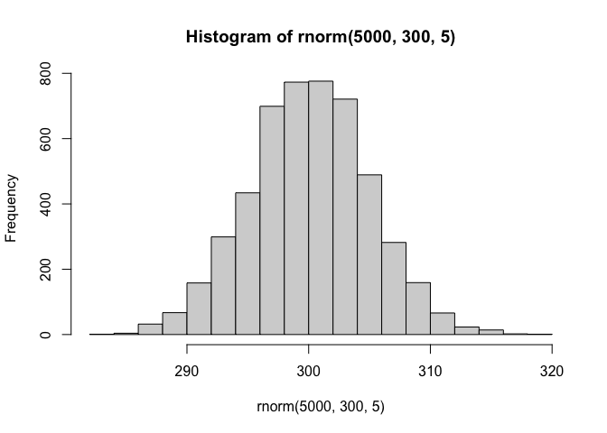
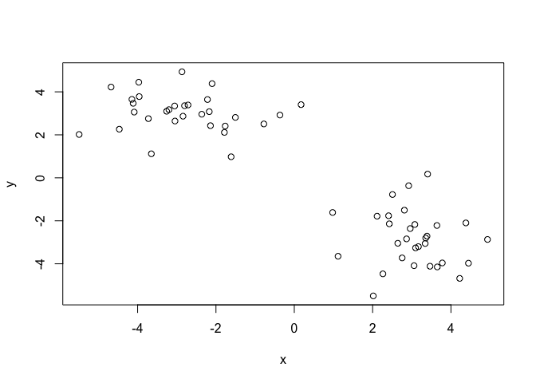
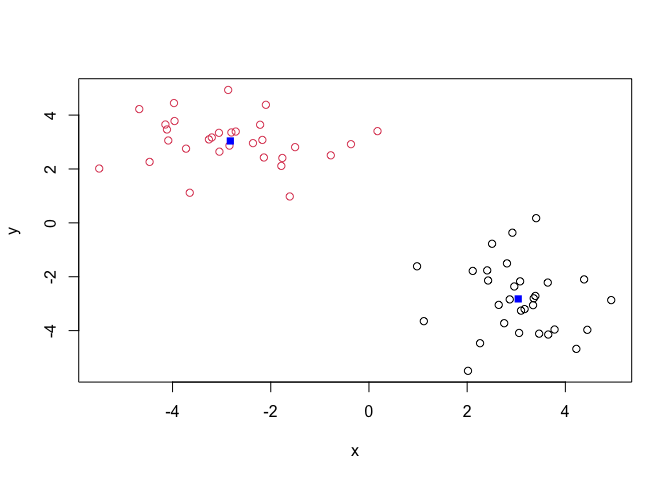
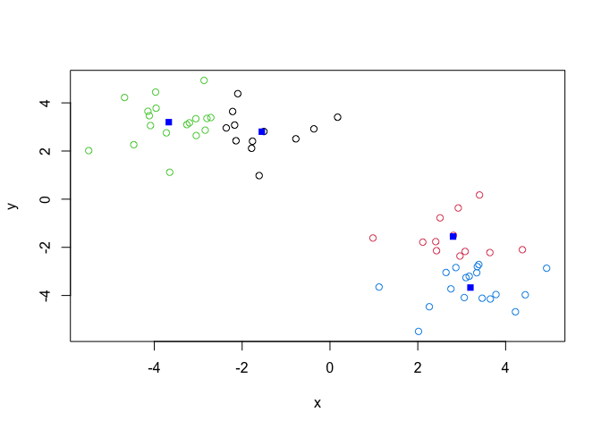
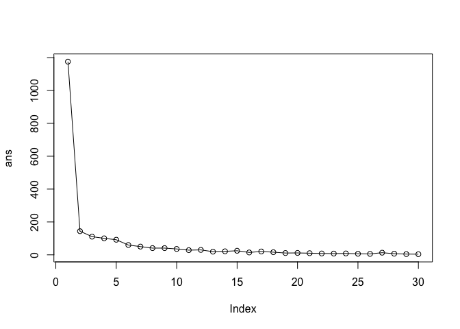
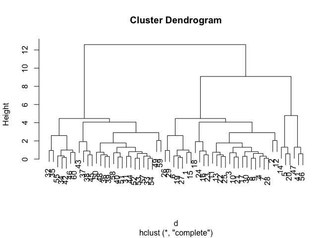
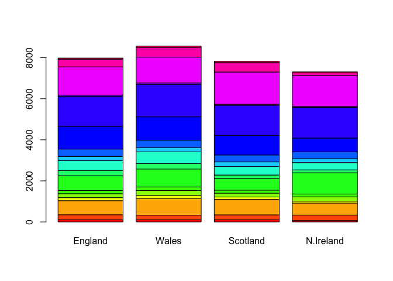
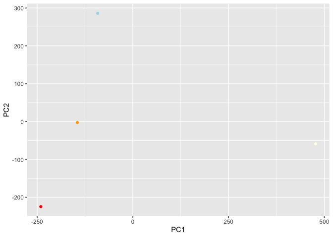

# Class 7: Machine Learning 1
Eric Wang (PID: A17678188)

## Background

Today we will begin our exploration of some important machine learning
methods, namely **clusterring** and **dimensionality reduction**.

Let’s make up some input data for clustering where we know what the
natural “clusters” are.

The function `rnorm()` can be useful here.

``` r
hist(rnorm(5000, 300, 5))
```



> Q. Generate 30 random numbers centered at + 3 and -3

``` r
tmp <- c(rnorm(30, 3), rnorm(30,-3))

x <- cbind(x= tmp, y=rev(tmp))

plot(x)
```



## K-means clustering

The main function in “base R” for K-means clustering is called
`kmeans()` :

``` r
km <- kmeans(x, 2)
km
```

    K-means clustering with 2 clusters of sizes 30, 30

    Cluster means:
              x         y
    1  3.040158 -2.823266
    2 -2.823266  3.040158

    Clustering vector:
     [1] 1 1 1 1 1 1 1 1 1 1 1 1 1 1 1 1 1 1 1 1 1 1 1 1 1 1 1 1 1 1 2 2 2 2 2 2 2 2
    [39] 2 2 2 2 2 2 2 2 2 2 2 2 2 2 2 2 2 2 2 2 2 2

    Within cluster sum of squares by cluster:
    [1] 72.00178 72.00178
     (between_SS / total_SS =  87.7 %)

    Available components:

    [1] "cluster"      "centers"      "totss"        "withinss"     "tot.withinss"
    [6] "betweenss"    "size"         "iter"         "ifault"      

> Q. What component of the results object details the cluster sizes?

``` r
km$size
```

    [1] 30 30

> Q. What component of the results object details the cluster centers?

``` r
km$centers
```

              x         y
    1  3.040158 -2.823266
    2 -2.823266  3.040158

> Q. What component of the results object details the cluster membership
> vector (i.e. our main result of which points lie in which cluster)

``` r
km$cluster
```

     [1] 1 1 1 1 1 1 1 1 1 1 1 1 1 1 1 1 1 1 1 1 1 1 1 1 1 1 1 1 1 1 2 2 2 2 2 2 2 2
    [39] 2 2 2 2 2 2 2 2 2 2 2 2 2 2 2 2 2 2 2 2 2 2

> Q. Plot our clustering results with points colored by cluster and also
> add the cluster centers as new points colored blue?

``` r
plot(x,col=km$cluster)
points(km$centers, col="blue",pch=15)
```



> Q. Run `kmeans()` again and this time produce 4 clusters and call your
> result object `k4`

``` r
k4 <- kmeans(x, 4)
plot(x, col= k4$cluster)
points(k4$centers, col="blue", pch=15)
```



The metric

``` r
k4$tot.withinss
```

    [1] 77.10121

> Q. Let’s try different number of K(centers) from 1 to 30 and see what
> the best result is?

``` r
ans <- NULL
for (i in 1:30){
ans <- c(ans, kmeans(x,centers = i)$tot.withinss)
}
ans
```

     [1] 1175.395784  144.003560  110.552385  100.387746   91.840272   59.692147
     [7]   50.051802   40.980034   40.985596   35.809693   28.538243   29.928725
    [13]   19.349694   21.391764   24.792929   14.511127   20.430834   16.142912
    [19]   11.008448   11.559613    9.971152    8.185676    7.569056    8.485052
    [25]    6.375357    5.643409   12.995677    6.918082    4.571490    3.937595

``` r
plot(ans,typ= "o")
```



`tot.withnss` shows how tight the cluster it is. The lower the value the
tighter the clusters group.

**Key-Point:** K-means will impose a clustering structure on your data
even if it is not there - it will always give you the answer you asked
for even if that answer is silly!

## Hierarchical Clustering

The main function for Hierarchical Clustering is called `hclust()`.
Unlike `kmeans()` (which does all the work for you) you can’t just pass
`hclust()` our raw input data. It needs a “distance matrix” like the one
returned from the `dist()` function.

``` r
d <- dist(x)
hc <- hclust(d)
plot(hc)
```



To extract our cluster membership vector from a `hclust()` result object
we have to “cut” our tree at a given height to yield separate
“groups”/“branches”.

To do this we use the `cutree()` function on our `hclust()` objection:

``` r
grps <- cutree(hc,h=8)
grps
```

     [1] 1 1 1 1 2 1 1 1 1 1 1 1 1 2 1 1 1 1 1 2 1 1 1 1 1 1 1 1 1 1 3 3 3 3 3 3 3 3
    [39] 3 3 2 3 3 3 3 3 2 3 3 3 3 3 3 3 3 2 3 3 3 3

``` r
table(grps, km$cluster)
```

        
    grps  1  2
       1 27  0
       2  3  3
       3  0 27

## PCA of UK food data

Import the data set of food consumption in the UK

``` r
url <- "https://tinyurl.com/UK-foods"
x <- read.csv(url)
x
```

                         X England Wales Scotland N.Ireland
    1               Cheese     105   103      103        66
    2        Carcass_meat      245   227      242       267
    3          Other_meat      685   803      750       586
    4                 Fish     147   160      122        93
    5       Fats_and_oils      193   235      184       209
    6               Sugars     156   175      147       139
    7      Fresh_potatoes      720   874      566      1033
    8           Fresh_Veg      253   265      171       143
    9           Other_Veg      488   570      418       355
    10 Processed_potatoes      198   203      220       187
    11      Processed_Veg      360   365      337       334
    12        Fresh_fruit     1102  1137      957       674
    13            Cereals     1472  1582     1462      1494
    14           Beverages      57    73       53        47
    15        Soft_drinks     1374  1256     1572      1506
    16   Alcoholic_drinks      375   475      458       135
    17      Confectionery       54    64       62        41

> Q1. How many rows and columns are in your new data frame named x? What
> R functions could you use to answer this questions?

``` r
dim(x)
```

    [1] 17  5

One soltion to set the row names is by hand…

``` r
#rownames(x)
rownames(x) <- x[,1]
```

To remove the first column I can use the minus index trick

``` r
x <- x[,-1]
x
```

                        England Wales Scotland N.Ireland
    Cheese                  105   103      103        66
    Carcass_meat            245   227      242       267
    Other_meat              685   803      750       586
    Fish                    147   160      122        93
    Fats_and_oils           193   235      184       209
    Sugars                  156   175      147       139
    Fresh_potatoes          720   874      566      1033
    Fresh_Veg               253   265      171       143
    Other_Veg               488   570      418       355
    Processed_potatoes      198   203      220       187
    Processed_Veg           360   365      337       334
    Fresh_fruit            1102  1137      957       674
    Cereals                1472  1582     1462      1494
    Beverages                57    73       53        47
    Soft_drinks            1374  1256     1572      1506
    Alcoholic_drinks        375   475      458       135
    Confectionery            54    64       62        41

A better way to do this is to set the row names to the first collumn
with `read.csv()`

``` r
x <- read.csv(url, row.names = 1)
x
```

                        England Wales Scotland N.Ireland
    Cheese                  105   103      103        66
    Carcass_meat            245   227      242       267
    Other_meat              685   803      750       586
    Fish                    147   160      122        93
    Fats_and_oils           193   235      184       209
    Sugars                  156   175      147       139
    Fresh_potatoes          720   874      566      1033
    Fresh_Veg               253   265      171       143
    Other_Veg               488   570      418       355
    Processed_potatoes      198   203      220       187
    Processed_Veg           360   365      337       334
    Fresh_fruit            1102  1137      957       674
    Cereals                1472  1582     1462      1494
    Beverages                57    73       53        47
    Soft_drinks            1374  1256     1572      1506
    Alcoholic_drinks        375   475      458       135
    Confectionery            54    64       62        41

> Q2. Which approach to solving the ‘row-names problem’ mentioned above
> do you prefer and why? Is one approach more robust than another under
> certain circumstances?

### Spotting major differences and trends

``` r
barplot(as.matrix(x), beside=T, col=rainbow(nrow(x)))
```


``` r
barplot(as.matrix(x), beside=F, col=rainbow(nrow(x)))
```



### Pairs plots and heatmaps

``` r
pairs(x, col=rainbow(nrow(x)), pch=16)
```


``` r
library(pheatmap)
pheatmap( as.matrix(x) )
```


## PCA to the rescue

The main PCA function in “base R” is called `prcomp()`. This function
wants the transpose of our food data as input (i.e. the foods as columns
and the countries as rows).

``` r
pca <- prcomp(t(x))
summary(pca)
```

    Importance of components:
                                PC1      PC2      PC3       PC4
    Standard deviation     324.1502 212.7478 73.87622 3.176e-14
    Proportion of Variance   0.6744   0.2905  0.03503 0.000e+00
    Cumulative Proportion    0.6744   0.9650  1.00000 1.000e+00

``` r
attributes(pca)
```

    $names
    [1] "sdev"     "rotation" "center"   "scale"    "x"       

    $class
    [1] "prcomp"

To make one of main PCA result figures we turn to `pca$x` the scores
along our new PCs. This is called “PC plot” or “score plot” or
“Ordination plot” …

``` r
library(ggplot2)
my_cols <- c("orange", "red", "lightblue", "lightyellow")
ggplot(pca$x)+ aes(PC1,PC2, label= rownames(pca$x)) +
  geom_point(col= my_cols)
```



the second major result figure is called a “loadings plot” of “variable
contributions plot” or “weight plot”

``` r
ggplot(pca$rotation) + 
  aes(PC1,rownames(pca$rotation)) + 
  geom_col()
```


