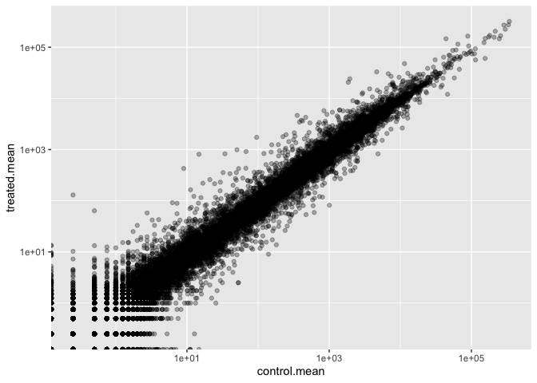
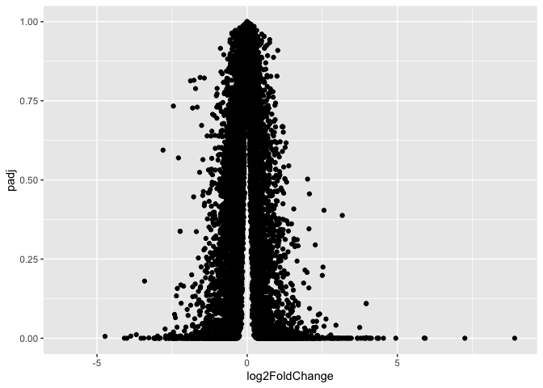
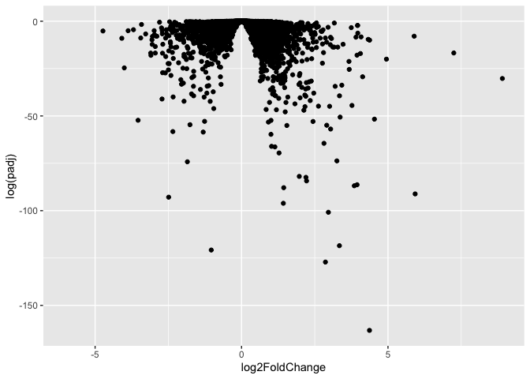
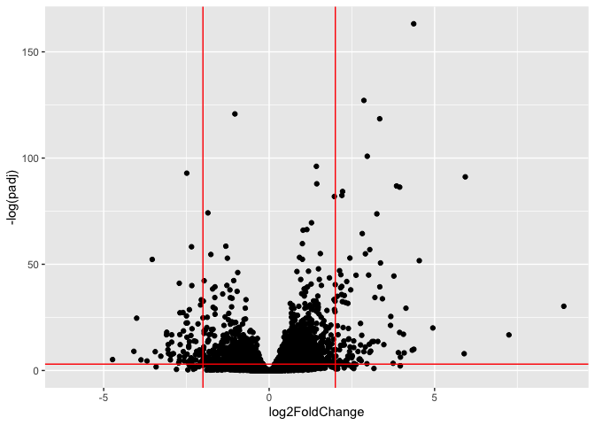
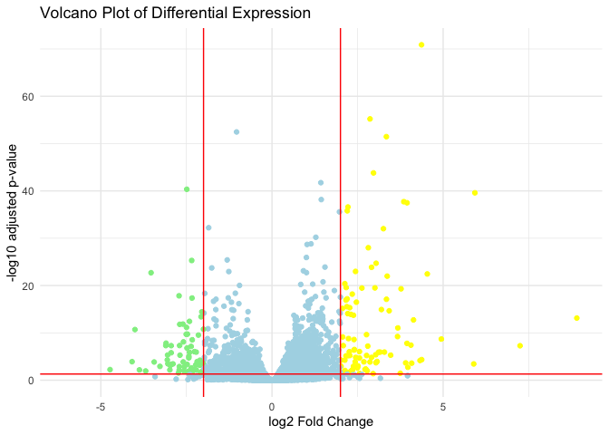

# Class 13 Transcriptomics and the analysis of RNA-Seq data
Eric Wang A17678188

- [Background](#background)
- [Data Import](#data-import)
- [Check on metadata counts
  correspondance](#check-on-metadata-counts-correspondance)
- [Analysis Plan…](#analysis-plan)
- [Log2 units and fold change](#log2-units-and-fold-change)
- [Remove zero count genes](#remove-zero-count-genes)
- [DESeq analysis](#deseq-analysis)
- [Volcano plot](#volcano-plot)
- [Add some plot annotation](#add-some-plot-annotation)
- [Save our results to a CSV file](#save-our-results-to-a-csv-file)
- [Add annotation Data](#add-annotation-data)
- [Pathway analysis](#pathway-analysis)

## Background

Today we will perform an RNASeq analysis on the effects of dexamethasone
(hereafter “dex”), a common steroid, on airway smooth muscle (ASM) cell
lines.

## Data Import

We need two things for this analysis:

- **countData**: a table with genes as rows and samples/experiments as
  columns,
- **colData**: metadata about the columns (i.e. samples) in the main
  countData object.

``` r
counts <- read.csv("airway_scaledcounts.csv", row.names=1)
metadata <- read.csv("airway_metadata.csv")
```

Let’s have a wee peak at these two objects:

``` r
metadata
```

              id     dex celltype     geo_id
    1 SRR1039508 control   N61311 GSM1275862
    2 SRR1039509 treated   N61311 GSM1275863
    3 SRR1039512 control  N052611 GSM1275866
    4 SRR1039513 treated  N052611 GSM1275867
    5 SRR1039516 control  N080611 GSM1275870
    6 SRR1039517 treated  N080611 GSM1275871
    7 SRR1039520 control  N061011 GSM1275874
    8 SRR1039521 treated  N061011 GSM1275875

``` r
head(counts)
```

                    SRR1039508 SRR1039509 SRR1039512 SRR1039513 SRR1039516
    ENSG00000000003        723        486        904        445       1170
    ENSG00000000005          0          0          0          0          0
    ENSG00000000419        467        523        616        371        582
    ENSG00000000457        347        258        364        237        318
    ENSG00000000460         96         81         73         66        118
    ENSG00000000938          0          0          1          0          2
                    SRR1039517 SRR1039520 SRR1039521
    ENSG00000000003       1097        806        604
    ENSG00000000005          0          0          0
    ENSG00000000419        781        417        509
    ENSG00000000457        447        330        324
    ENSG00000000460         94        102         74
    ENSG00000000938          0          0          0

## Check on metadata counts correspondance

We need to check that the metadata matches the samples in our count
data.

``` r
ncol(counts) == nrow(metadata)
```

    [1] TRUE

``` r
colnames(counts) == metadata$id
```

    [1] TRUE TRUE TRUE TRUE TRUE TRUE TRUE TRUE

``` r
all( c(T,T,T,T))
```

    [1] TRUE

> Q1. how many genes are in this dataset?

``` r
nrow(counts)
```

    [1] 38694

> Q2. How many “control” samples are in this dataset?

``` r
sum(metadata$dex == "control")
```

    [1] 4

## Analysis Plan…

We have 4 replicates per condition (“control” and “treated”). We want to
compare the control vs the treated to see which genes expression levels
change when we have the drug present.

We will go row by row (gene by gene) and see if the average value in
control columns is different than the average value in treated columns

- Step 1. Find which columns in `counts` correspond to “control”
  samples.

- Step 2. Extract/select these columns

- Step 3. Calculate an average value for each gene (i.e. each row).

``` r
# The indices (i.e positions) that are "control" 
control.inds <- metadata$dex == "control"
```

``` r
# Extract/select these "control" columns from counts
control.counts <- counts[,control.inds]
```

``` r
# Calculate the mean for each gene (i.e row)
control.mean <- rowMeans(control.counts)
```

> Q. Do the same for “treated” samples - find the mean count value per
> gene

``` r
treated.inds <- metadata$dex == "treated"
treated.counts <- counts[,treated.inds]
treated.mean <- rowMeans(treated.counts)
```

Let’s put these two mean values into a new data.frame `meancounts` for
easy book-keeping and plotting.

``` r
meancounts <- data.frame(control.mean, treated.mean)
head(meancounts)
```

                    control.mean treated.mean
    ENSG00000000003       900.75       658.00
    ENSG00000000005         0.00         0.00
    ENSG00000000419       520.50       546.00
    ENSG00000000457       339.75       316.50
    ENSG00000000460        97.25        78.75
    ENSG00000000938         0.75         0.00

> Q. Make a ggplot of average counts of control vs treated.

``` r
library(ggplot2)
ggplot(meancounts, aes(control.mean, treated.mean)) + geom_point(alpha = 0.3) + scale_x_log10() + scale_y_log10()
```

    Warning in scale_x_log10(): log-10 transformation introduced infinite values.

    Warning in scale_y_log10(): log-10 transformation introduced infinite values.



## Log2 units and fold change

If we consider “treated”/ “control” counts we will get a number that
tells us the change.

``` r
# No change
log2(20/20)
```

    [1] 0

``` r
# A doubling in the treated vs control
log2(40/20)
```

    [1] 1

``` r
log2(10/40)
```

    [1] -2

> Q. Add a new column `log2fc` for log2 fold change of treated/control
> to our `meancounts` object.

``` r
meancounts$log2fc <- 
  log2(meancounts$treated.mean/meancounts$control.mean)

head(meancounts)
```

                    control.mean treated.mean      log2fc
    ENSG00000000003       900.75       658.00 -0.45303916
    ENSG00000000005         0.00         0.00         NaN
    ENSG00000000419       520.50       546.00  0.06900279
    ENSG00000000457       339.75       316.50 -0.10226805
    ENSG00000000460        97.25        78.75 -0.30441833
    ENSG00000000938         0.75         0.00        -Inf

## Remove zero count genes

Typically we would not consider zero count genes - as we have no data
about them and they should be excluded from further consideration. These
lead to “funky” log2 fold change values (e.g. divide by zero errors
etc.)

## DESeq analysis

We are missing any measure of significance from the work we had so far.
Let’s do this properly with the **DESeq2** package.

``` r
library(DESeq2)
```

The DESeq2 package, like many bioconductor packages, wants it’s input in
a very specific way - a data structure setup with all the info it needs
for the calculation.

``` r
dds <- DESeqDataSetFromMatrix(countData = counts, colData = metadata, design = ~dex)
```

    converting counts to integer mode

    Warning in DESeqDataSet(se, design = design, ignoreRank): some variables in
    design formula are characters, converting to factors

The main function in this package is called `DESeq()` it will run the
full analysis for us on our `dds` input object:

``` r
dds <- DESeq(dds)
```

    estimating size factors

    estimating dispersions

    gene-wise dispersion estimates

    mean-dispersion relationship

    final dispersion estimates

    fitting model and testing

Extract our results:

``` r
res <-results(dds)
head(res)
```

    log2 fold change (MLE): dex treated vs control 
    Wald test p-value: dex treated vs control 
    DataFrame with 6 rows and 6 columns
                      baseMean log2FoldChange     lfcSE      stat    pvalue
                     <numeric>      <numeric> <numeric> <numeric> <numeric>
    ENSG00000000003 747.194195     -0.3507030  0.168246 -2.084470 0.0371175
    ENSG00000000005   0.000000             NA        NA        NA        NA
    ENSG00000000419 520.134160      0.2061078  0.101059  2.039475 0.0414026
    ENSG00000000457 322.664844      0.0245269  0.145145  0.168982 0.8658106
    ENSG00000000460  87.682625     -0.1471420  0.257007 -0.572521 0.5669691
    ENSG00000000938   0.319167     -1.7322890  3.493601 -0.495846 0.6200029
                         padj
                    <numeric>
    ENSG00000000003  0.163035
    ENSG00000000005        NA
    ENSG00000000419  0.176032
    ENSG00000000457  0.961694
    ENSG00000000460  0.815849
    ENSG00000000938        NA

## Volcano plot

A useful summary figure of our results is often called a volcano pot. It
is basically a plot of log2 fold change values vs Adjusted p-values.

> Q. use ggplot to make a first version “volcano plot” of
> `log2FoldChange` vs `padj`

``` r
ggplot(res, aes(log2FoldChange, padj)) + geom_point()
```

    Warning: Removed 23549 rows containing missing values or values outside the scale range
    (`geom_point()`).



This is not very useful because the y-axis (p-value) is not really
helpful - we want to focus on low p-values

``` r
ggplot(res, aes(log2FoldChange, log(padj))) + geom_point()
```

    Warning: Removed 23549 rows containing missing values or values outside the scale range
    (`geom_point()`).



``` r
ggplot(res, aes(log2FoldChange, -log(padj))) + geom_point() + geom_vline(xintercept = c(-2,+2), col = "red") + geom_hline(yintercept = -log(0.05), col = "red")
```

    Warning: Removed 23549 rows containing missing values or values outside the scale range
    (`geom_point()`).



## Add some plot annotation

> Q. Add color to the points (genes) we care about, nice axis labels, a
> useful title and a nice theme.

``` r
mycols <- rep("lightblue", nrow(res))
mycols[res$log2FoldChange > 2] <- "yellow"
mycols[res$log2FoldChange < -2] <- "lightgreen"
mycols[res$padj >= 0.05] <- "lightblue"
ggplot(res, aes(log2FoldChange, -log10(padj))) +
  geom_point(col = mycols) +
  geom_vline(xintercept = c(-2, 2), color = "red") +
  geom_hline(yintercept = -log10(0.05), color = "red") +
  labs(
    x = "log2 Fold Change",
    y = "-log10 adjusted p-value",
    title = "Volcano Plot of Differential Expression"
  ) +
  theme_minimal()
```

    Warning: Removed 23549 rows containing missing values or values outside the scale range
    (`geom_point()`).



## Save our results to a CSV file

``` r
write.csv(res,file = "results.csv")
```

## Add annotation Data

To make sense of our results we need to know what the differentially
expressed genes are and what biological pathways and process they are
involved in.

``` r
head(res)
```

    log2 fold change (MLE): dex treated vs control 
    Wald test p-value: dex treated vs control 
    DataFrame with 6 rows and 6 columns
                      baseMean log2FoldChange     lfcSE      stat    pvalue
                     <numeric>      <numeric> <numeric> <numeric> <numeric>
    ENSG00000000003 747.194195     -0.3507030  0.168246 -2.084470 0.0371175
    ENSG00000000005   0.000000             NA        NA        NA        NA
    ENSG00000000419 520.134160      0.2061078  0.101059  2.039475 0.0414026
    ENSG00000000457 322.664844      0.0245269  0.145145  0.168982 0.8658106
    ENSG00000000460  87.682625     -0.1471420  0.257007 -0.572521 0.5669691
    ENSG00000000938   0.319167     -1.7322890  3.493601 -0.495846 0.6200029
                         padj
                    <numeric>
    ENSG00000000003  0.163035
    ENSG00000000005        NA
    ENSG00000000419  0.176032
    ENSG00000000457  0.961694
    ENSG00000000460  0.815849
    ENSG00000000938        NA

Let’s start by mapping our ENSEMBLE ids to the more conventional gene
SYMBOL.

We will use two bioconductor packages for this “mapping”
**AnnotationDbi** and **org.Hs.eg.db**.

We will first need to install these from bioconductor with
`BiocManager::install("")`

``` r
library(AnnotationDbi)
library(org.Hs.eg.db)
```

``` r
columns(org.Hs.eg.db)
```

     [1] "ACCNUM"       "ALIAS"        "ENSEMBL"      "ENSEMBLPROT"  "ENSEMBLTRANS"
     [6] "ENTREZID"     "ENZYME"       "EVIDENCE"     "EVIDENCEALL"  "GENENAME"    
    [11] "GENETYPE"     "GO"           "GOALL"        "IPI"          "MAP"         
    [16] "OMIM"         "ONTOLOGY"     "ONTOLOGYALL"  "PATH"         "PFAM"        
    [21] "PMID"         "PROSITE"      "REFSEQ"       "SYMBOL"       "UCSCKG"      
    [26] "UNIPROT"     

``` r
res$symbol <- mapIds(org.Hs.eg.db,
       keys = rownames(res), # Our ids
       keytype = "ENSEMBL", # Their format
       column= "SYMBOL") # What I want to translate to 
```

    'select()' returned 1:many mapping between keys and columns

``` r
head(res)
```

    log2 fold change (MLE): dex treated vs control 
    Wald test p-value: dex treated vs control 
    DataFrame with 6 rows and 7 columns
                      baseMean log2FoldChange     lfcSE      stat    pvalue
                     <numeric>      <numeric> <numeric> <numeric> <numeric>
    ENSG00000000003 747.194195     -0.3507030  0.168246 -2.084470 0.0371175
    ENSG00000000005   0.000000             NA        NA        NA        NA
    ENSG00000000419 520.134160      0.2061078  0.101059  2.039475 0.0414026
    ENSG00000000457 322.664844      0.0245269  0.145145  0.168982 0.8658106
    ENSG00000000460  87.682625     -0.1471420  0.257007 -0.572521 0.5669691
    ENSG00000000938   0.319167     -1.7322890  3.493601 -0.495846 0.6200029
                         padj      symbol
                    <numeric> <character>
    ENSG00000000003  0.163035      TSPAN6
    ENSG00000000005        NA        TNMD
    ENSG00000000419  0.176032        DPM1
    ENSG00000000457  0.961694       SCYL3
    ENSG00000000460  0.815849       FIRRM
    ENSG00000000938        NA         FGR

> Q. Can you add “GENENAME” and “ENTREZID as new columns to `res`
> nmaed”name” and “entrez”?

``` r
res$name <- mapIds(org.Hs.eg.db,
       keys = rownames(res), # Our ids
       keytype = "ENSEMBL", # Their format
       column= "GENENAME") # What I want to translate to 
```

    'select()' returned 1:many mapping between keys and columns

``` r
res$entrez <- mapIds(org.Hs.eg.db,
       keys = rownames(res), # Our ids
       keytype = "ENSEMBL", # Their format
       column= "ENTREZID") # What I want to translate to 
```

    'select()' returned 1:many mapping between keys and columns

``` r
head(res)
```

    log2 fold change (MLE): dex treated vs control 
    Wald test p-value: dex treated vs control 
    DataFrame with 6 rows and 9 columns
                      baseMean log2FoldChange     lfcSE      stat    pvalue
                     <numeric>      <numeric> <numeric> <numeric> <numeric>
    ENSG00000000003 747.194195     -0.3507030  0.168246 -2.084470 0.0371175
    ENSG00000000005   0.000000             NA        NA        NA        NA
    ENSG00000000419 520.134160      0.2061078  0.101059  2.039475 0.0414026
    ENSG00000000457 322.664844      0.0245269  0.145145  0.168982 0.8658106
    ENSG00000000460  87.682625     -0.1471420  0.257007 -0.572521 0.5669691
    ENSG00000000938   0.319167     -1.7322890  3.493601 -0.495846 0.6200029
                         padj      symbol                   name      entrez
                    <numeric> <character>            <character> <character>
    ENSG00000000003  0.163035      TSPAN6          tetraspanin 6        7105
    ENSG00000000005        NA        TNMD            tenomodulin       64102
    ENSG00000000419  0.176032        DPM1 dolichyl-phosphate m..        8813
    ENSG00000000457  0.961694       SCYL3 SCY1 like pseudokina..       57147
    ENSG00000000460  0.815849       FIRRM FIGNL1 interacting r..       55732
    ENSG00000000938        NA         FGR FGR proto-oncogene, ..        2268

``` r
write.csv(res, file="results_annotated.csv")
```

## Pathway analysis

Now we know the gene names (gene symbols) and their entrez IDs we can
find out what pathways they are involved in. This is called “pathway
analysis” or “gene set enrichment”

We will use the **gage** package and the **pathviewer** package to do
this analysis (but there are loads of others).

``` r
library(pathview)
library(gage)
library(gageData)
```

Let’s see what is in gageData, specifically KEGG pathways:

``` r
data(kegg.sets.hs)
head(kegg.sets.hs,2)
```

    $`hsa00232 Caffeine metabolism`
    [1] "10"   "1544" "1548" "1549" "1553" "7498" "9"   

    $`hsa00983 Drug metabolism - other enzymes`
     [1] "10"     "1066"   "10720"  "10941"  "151531" "1548"   "1549"   "1551"  
     [9] "1553"   "1576"   "1577"   "1806"   "1807"   "1890"   "221223" "2990"  
    [17] "3251"   "3614"   "3615"   "3704"   "51733"  "54490"  "54575"  "54576" 
    [25] "54577"  "54578"  "54579"  "54600"  "54657"  "54658"  "54659"  "54963" 
    [33] "574537" "64816"  "7083"   "7084"   "7172"   "7363"   "7364"   "7365"  
    [41] "7366"   "7367"   "7371"   "7372"   "7378"   "7498"   "79799"  "83549" 
    [49] "8824"   "8833"   "9"      "978"   

To run our pathway analysis we will use the **gage()** function. It
wants two main inputs: a vector of importance (in our case the log2 fold
change values); and the gene sets to cehck overlap for.

``` r
foldchanges <- res$log2FoldChange
names(foldchanges) <- res$symbol
head(foldchanges)
```

         TSPAN6        TNMD        DPM1       SCYL3       FIRRM         FGR 
    -0.35070302          NA  0.20610777  0.02452695 -0.14714205 -1.73228897 

KEGG speaks entrez (i.e. uses ENTREZID format) not gene symbol format.

``` r
names(foldchanges) <- res$entrez
head(foldchanges)
```

           7105       64102        8813       57147       55732        2268 
    -0.35070302          NA  0.20610777  0.02452695 -0.14714205 -1.73228897 

``` r
keggres = gage(foldchanges, gsets=kegg.sets.hs)
head(keggres$less, 5)
```

                                                             p.geomean stat.mean
    hsa05332 Graft-versus-host disease                    0.0004250461 -3.473346
    hsa04940 Type I diabetes mellitus                     0.0017820293 -3.002352
    hsa05310 Asthma                                       0.0020045888 -3.009050
    hsa04672 Intestinal immune network for IgA production 0.0060434515 -2.560547
    hsa05330 Allograft rejection                          0.0073678825 -2.501419
                                                                 p.val      q.val
    hsa05332 Graft-versus-host disease                    0.0004250461 0.09053483
    hsa04940 Type I diabetes mellitus                     0.0017820293 0.14232581
    hsa05310 Asthma                                       0.0020045888 0.14232581
    hsa04672 Intestinal immune network for IgA production 0.0060434515 0.31387180
    hsa05330 Allograft rejection                          0.0073678825 0.31387180
                                                          set.size         exp1
    hsa05332 Graft-versus-host disease                          40 0.0004250461
    hsa04940 Type I diabetes mellitus                           42 0.0017820293
    hsa05310 Asthma                                             29 0.0020045888
    hsa04672 Intestinal immune network for IgA production       47 0.0060434515
    hsa05330 Allograft rejection                                36 0.0073678825

Let’s make a figure of one of these pathways with our DEGs highlighted:

``` r
pathview(foldchanges, pathway.id = "hsa05310")
```

    'select()' returned 1:1 mapping between keys and columns

    Info: Working in directory /Users/ruw056/Desktop/BIMM143/bimm143_github/Class13copy

    Info: Writing image file hsa05310.pathview.png


> Q. Generate and insert a pathway figure for “Graft-versus-host diases”
> and “Type I diabetes”?

``` r
pathview(foldchanges, pathway.id = "hsa05332")
```

    'select()' returned 1:1 mapping between keys and columns

    Info: Working in directory /Users/ruw056/Desktop/BIMM143/bimm143_github/Class13copy

    Info: Writing image file hsa05332.pathview.png

``` r
pathview(foldchanges, pathway.id = "hsa04940")
```

    'select()' returned 1:1 mapping between keys and columns

    Info: Working in directory /Users/ruw056/Desktop/BIMM143/bimm143_github/Class13copy

    Info: Writing image file hsa04940.pathview.png


